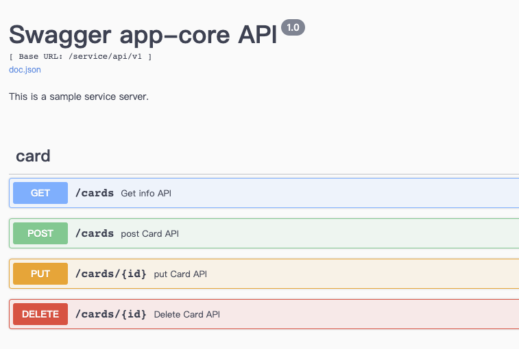

## go-rest-arch
[](https://goreportcard.com/report/github.com/minilabmemo/go-rest-arch)


- 根據 [go-clean-arch](https://github.com/bxcodec/go-clean-arch) 架構．加入簡單的MongoDb DRUD操作
- This example is a simple example of RESTful API and Mongo database operation


### Tools/Libraries Used
All version info listed in go.mod
- viper
- zaplog
- swagger UI : http://localhost:8888/swagger/index.html
> install: github.com/swaggo/swag/cmd/swag
> annotations guide: https://github.com/swaggo/swag
> use :
> ```
> cd cmd/app-core
> swag init -pd  //-parseDependency
> ```
> 
- Gin Framework
- httptest


### start

#### go run / go build
```
cd cmd/app-core
go run main.go
go build -o app-core ./cmd/app-core/.
```

#### docker build 
`docker build -t app-core .`
>Note: 在`docker build -t app-core .` 時 
會發現 RUN command 或者makefile print 沒有output顯示，無法幫助debug的話，這時可以在前面加上DOCKER_BUILDKIT=0 也就是
`DOCKER_BUILDKIT=0 docker build -t app-core .`
see https://makeoptim.com/en/tool/docker-build-not-output


#### docker run
```
$ docker run -p 8888:8888 app-core
2023/01/22 05:43:05 viper.ConfigFileUsed OK: /configs/docker/service.toml
2023/01/22 05:43:05 data: app-core
2023/01/22 05:43:05 Mongo: mongo
2023/01/22 05:43:05 Service.Name: app-core
2023-01-22T05:43:05.550Z        INFO    logger/zap.go:10        InitLogger done
2023-01-22T05:43:05.552Z        INFO    apis/server.go:21       Listening on port: 8888,http://0.0.0.:8888/swagger/index.html
2023-01-22T05:43:05.553Z        INFO    app-core/main.go:45     Service started in: 2.2989ms
2023-01-22T05:43:05.553Z        INFO    app-core/main.go:46     Version 1.0.0
collection_todo 
```

#### Swagger UI



#### test
```
cd root
go test -v ./...
```

### reference
- [go-clean-arch](https://github.com/bxcodec/go-clean-arch)
